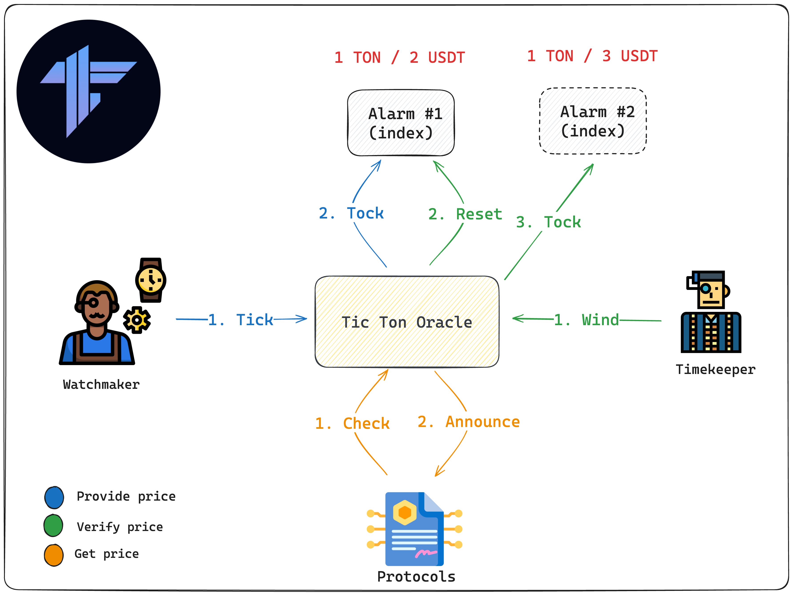
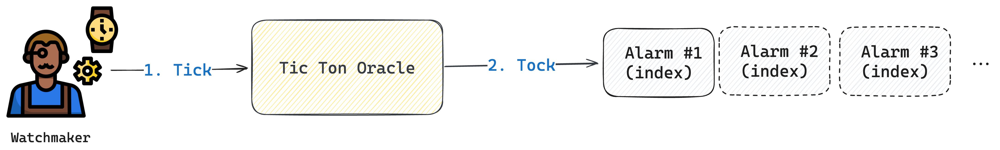
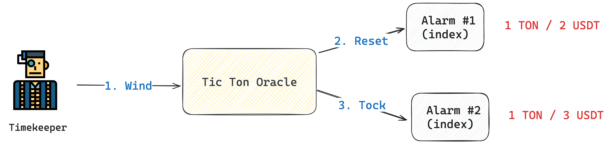
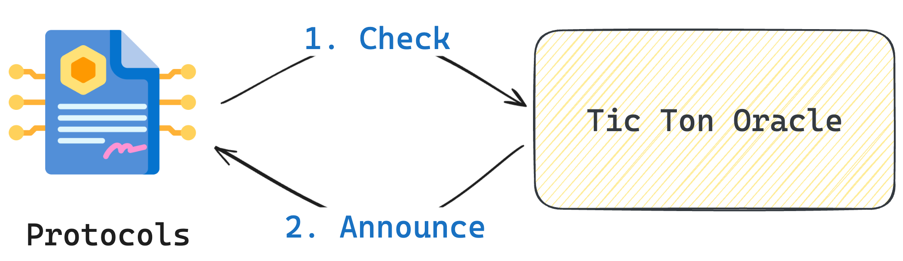
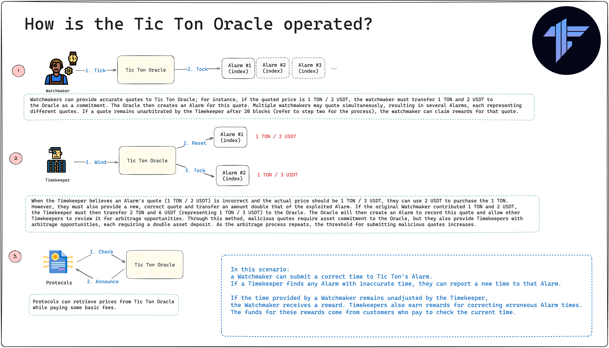

# Tic Ton Oracle

## Table of Contents
- [Tic Ton Oracle](#tic-ton-oracle)
  - [Table of Contents](#table-of-contents)
  - [What is Tic Ton Oracle?](#what-is-tic-ton-oracle)
  - [Motivation](#motivation)
  - [Core Concepts](#core-concepts)
  - [The benefits of  Tic Ton Oracle](#the-benefits-of--tic-ton-oracle)
    - [High Transactions per second in TON:](#high-transactions-per-second-in-ton)
    - [Decentralization](#decentralization)
    - [Stability and Safeguarding](#stability-and-safeguarding)
  - [How is the Tic Ton Oracle operated?](#how-is-the-tic-ton-oracle-operated)
    - [Architecture](#architecture)
    - [In-Depth Architecture Breakdown](#in-depth-architecture-breakdown)
    - [Step1: Provide price by Watchmaker](#step1-provide-price-by-watchmaker)
    - [Step2: Verify price by Timekeeper](#step2-verify-price-by-timekeeper)
    - [Step3: Protocols get price](#step3-protocols-get-price)
    - [Summary](#summary)
  - [Project structure](#project-structure)
  - [How to use](#how-to-use)
    - [Build](#build)
    - [Test](#test)
    - [Deploy or run another script](#deploy-or-run-another-script)
    - [Add a new contract](#add-a-new-contract)

## What is Tic Ton Oracle?
Tic Ton oracle stands as the premier fully decentralized oracle on the TON platform. Diverging from market-standard final prices set by price providers, it employs Game Theory to craft a decentralized network of non-cooperative games. This network ascertains the ultimate price via mechanisms of arbitrage and bidirectional options, incorporating the chain with random data from decentralized price streams.

## Motivation
Inspired by Uniswap's oracle, we believe that a **true oracle should generate prices directly on-chain**, rather than merely uploading pre-processed off-chain data. Oracles should be **decentralized**, not reliant on centralized data providers, and possess the ability to withstand attacks, instead of depending solely on the reputation of data sources. Moreover, an effective oracle should be capable of **supporting large-scale transactions**, not just dependent on the capacity of data providers.

## Core Concepts

## The benefits of  Tic Ton Oracle
When contrasted with traditional price feed systems, Tic Ton Oracle boasts several key benefits:

### High Transactions per second in TON:
Due to TON's significantly high TPS, the wait time during the verification period can be reduced. For instance, while Ethereum requires a 12-second wait for each block, TON can achieve a block every second. Therefore, if price verification necessitates 10 blocks, it would only take 10 seconds on TON as opposed to 120 seconds on Ethereum. Consequently, employing oracles on TON can provide more immediate and efficient pricing.

### Decentralization
Tic Ton oracle operates in a fully open and complimentary manner, facilitating price proposals and validations through a non-cooperative game approach. This eliminates the need for any centralized oversight or entry barriers for the quoting system, allowing anyone to participate or disengage freely, anytime and anywhere.

### Stability and Safeguarding
Tic Ton oracle empowers all participants to contribute to and shape the price formation on the blockchain. Concurrently, it guides the price data towards a fair market value, safeguarded by its underlying mechanism. Orchestrating a price manipulation requires control over 51% of the assets within the oracle's network. Any anomalies in pricing within the Tic Ton Oracle are subject to adjustment by the collective efforts of all validators.

## How is the Tic Ton Oracle operated?

### Architecture

### In-Depth Architecture Breakdown
**You can envision the Tic Ton Oracle  as the story below:**

A Watchmaker can submit a correct time to Tic Ton's Alarm.
If a Timekeeper finds any Alarm with inaccurate time, they can report a new time to that Alarm.

If the time provided by a Watchmaker remains unadjusted by the Timekeeper,
the Watchmaker receives a reward. Timekeepers also earn rewards for correcting erroneous Alarm times.
The funds for these rewards come from customers who pay to check the current time.

### Step1: Provide price by Watchmaker

### Step2: Verify price by Timekeeper

When the Timekeeper believes an Alarm's quote (1 TON / 2 USDT) is incorrect and the actual price should be 1 TON / 3 USDT, they can use 2 USDT to purchase the 1 TON.However, they must also provide a new, correct quote and transfer an amount double that of the exploited Alarm. If the original Watchmaker contributed 1 TON and 2 USDT, the Timekeeper must then transfer 2 TON and 6 USDT (representing 1 TON / 3 USDT) to the Oracle. The Oracle will then create an Alarm to record this quote and allow other Timekeepers to review it for arbitrage opportunities. Through this method, malicious quotes require asset commitment to the Oracle, but they also provide Timekeepers with arbitrage opportunities, each requiring a double asset deposit. As the arbitrage process repeats, the threshold for submitting malicious quotes increases.

### Step3: Protocols get price 

Protocols can retrieve prices from Tic Ton Oracle while paying some basic fees.

### Summary

## Project structure

-   `contracts` - source code of all the smart contracts of the project and their dependencies.
-   `wrappers` - wrapper classes (implementing `Contract` from ton-core) for the contracts, including any [de]serialization primitives and compilation functions.
-   `tests` - tests for the contracts.
-   `scripts` - scripts used by the project, mainly the deployment scripts.

## How to use

### Build

`npx blueprint build` or `yarn blueprint build`

### Test

`npx blueprint test` or `yarn blueprint test`

### Deploy or run another script

`npx blueprint run` or `yarn blueprint run`

### Add a new contract

`npx blueprint create ContractName` or `yarn blueprint create ContractName`
